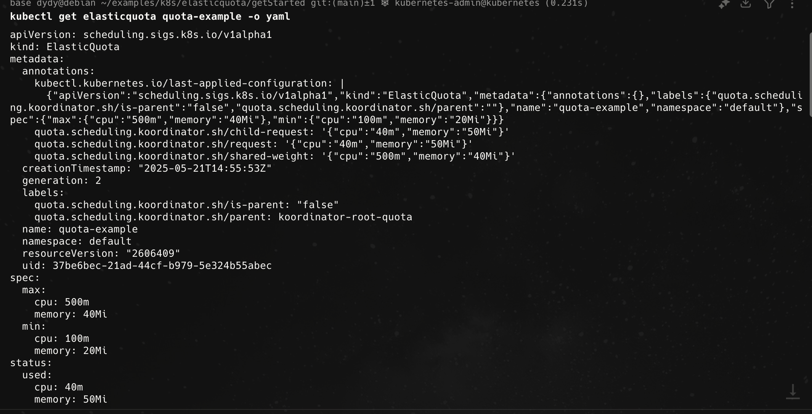
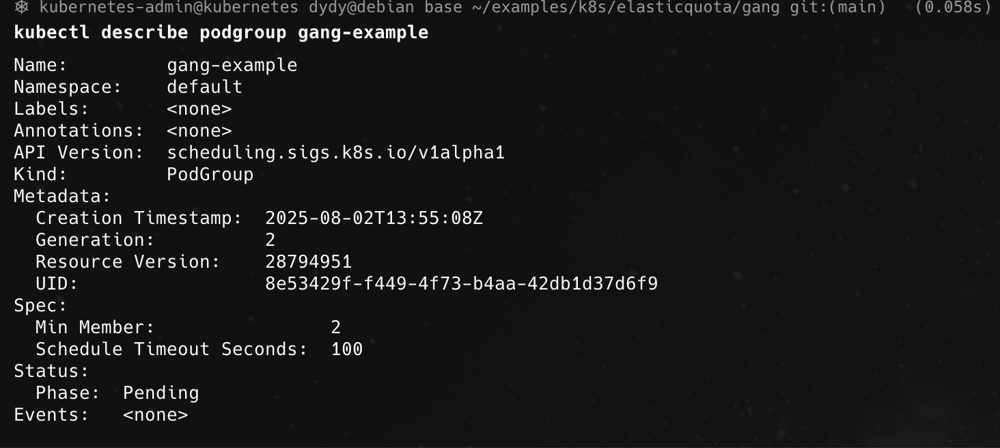
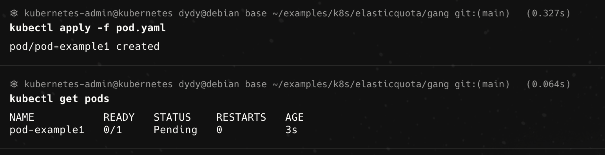
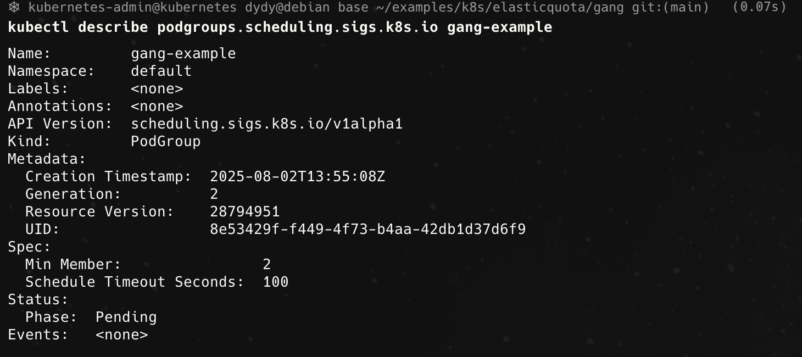
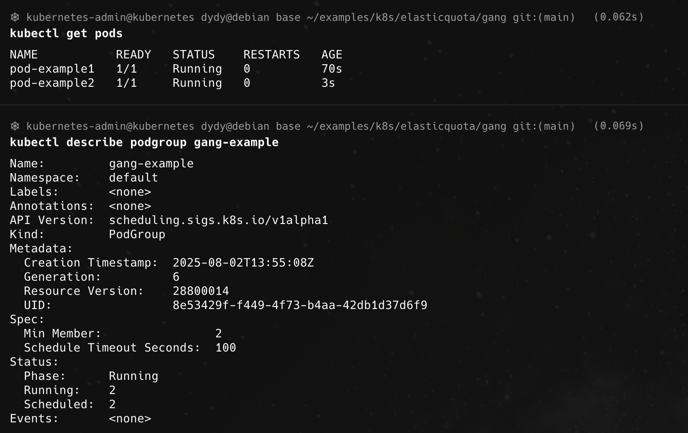

# ElasticQuota

## 安装

- 安装`Helm`

```bash
curl -fsSL -o get_helm.sh https://raw.githubusercontent.com/helm/helm/main/scripts/get-helm-3
bash get_helm.sh
```

- 通过`Helm`安装`ElasticQuota`

```bash
# Firstly add koordinator charts repository if you haven't do this.
helm repo add koordinator-sh https://koordinator-sh.github.io/charts/

# [Optional]
helm repo update

# Install the latest version.
helm install koordinator koordinator-sh/koordinator --version 1.6.0
```

## Quick Start

```bash
cd getStarted
kubectl apply -f quota-example.yaml
kubectl apply -f pod-example.yaml
```

可以通过

```bash
kubectl describe elasticquota quota-example
```

得到当前配额资源的使用情况，得到的结果如下


再新建一个跟原来相同的`pods`

```bash
kubectl apply -f pod2-example.yaml
```

可以看到它正在`pending`


把原本正在运行的`pods`删掉


> 无法直接删除还有child pods的Quota
> 

- 如果`pod`不指定执行的`scheduler`，那么`pod`还是会被成功调度，但是通过查询配额，还是能够查到其消耗资源的记录




## 父子配额

- 创建父子配额

```bash
cd parentQuota
kubectl apply -f parent-quota.yaml
```

## Evict

通过

```bash
kubectl get configmaps -n koordinator-system koord-scheduler-config -o yaml
```

可以通过查看`evict/config.yaml`得到原来的

# GangScheduler

## Quick Start

```yaml
apiVersion: scheduling.sigs.k8s.io/v1alpha1
kind: PodGroup
metadata:
  name: gang-example
  namespace: default
spec:
  scheduleTimeoutSeconds: 100
  minMember: 2
```



```yaml
apiVersion: v1
kind: Pod
metadata:
  name: pod-example1
  namespace: default
  labels:
    pod-group.scheduling.sigs.k8s.io: gang-example
spec:
  schedulerName: koord-scheduler
  containers:
  - command:
    - sleep
    - 365d
    image: busybox
    imagePullPolicy: IfNotPresent
    name: curlimage
    resources:
      limits:
        cpu: 40m
        memory: 40Mi
      requests:
        cpu: 40m
        memory: 40Mi
    terminationMessagePath: /dev/termination-log
    terminationMessagePolicy: File
  restartPolicy: Always
```





```yaml
apiVersion: v1
kind: Pod
metadata:
  name: pod-example2
  namespace: default
  labels:
    pod-group.scheduling.sigs.k8s.io: gang-example
spec:
  schedulerName: koord-scheduler
  containers:
  - command:
    - sleep
    - 365d
    image: busybox
    imagePullPolicy: IfNotPresent
    name: curlimage
    resources:
      limits:
        cpu: 40m
        memory: 40Mi
      requests:
        cpu: 40m
        memory: 40Mi
    terminationMessagePath: /dev/termination-log
    terminationMessagePolicy: File
  restartPolicy: Always
```


