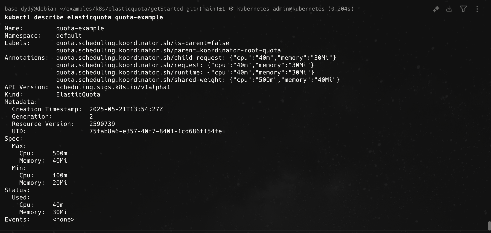
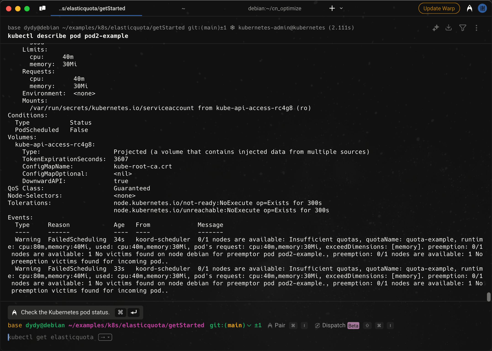
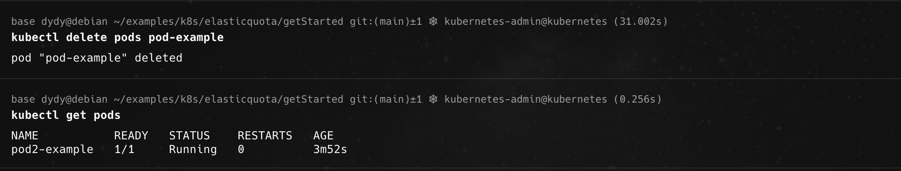
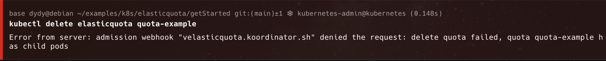

# ElasticQuota

## 安装

- 安装`Helm`

```bash
curl -fsSL -o get_helm.sh https://raw.githubusercontent.com/helm/helm/main/scripts/get-helm-3
bash get_helm.sh
```

- 通过`Helm`安装`ElasticQuota`

```bash
# Firstly add koordinator charts repository if you haven't do this.
helm repo add koordinator-sh https://koordinator-sh.github.io/charts/

# [Optional]
helm repo update

# Install the latest version.
helm install koordinator koordinator-sh/koordinator --version 1.6.0
```

## Quick Start

```bash
cd getStarted
kubectl apply -f quota-example.yaml
kubectl apply -f pod-example.yaml
```

可以通过

```bash
kubectl describe elasticquota quota-example
```

得到当前配额资源的使用情况，得到的结果如下



再新建一个跟原来相同的`pods`

```bash
kubectl apply -f pod2-example.yaml
```

可以看到它正在`pending`



把原本正在运行的`pods`删掉



> 无法直接删除还有child pods的Quota
> 